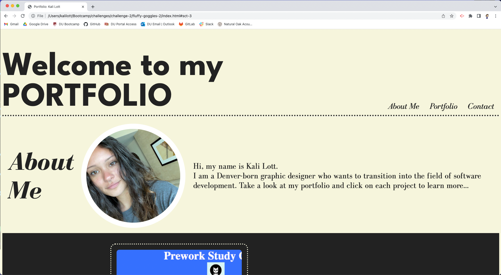
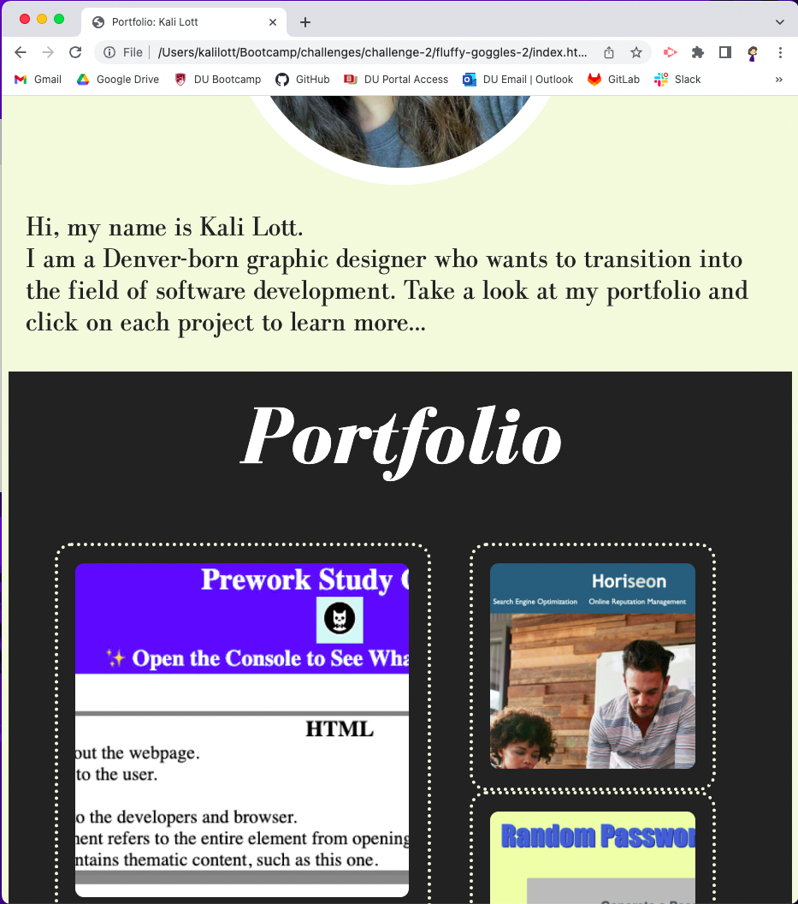

# fluffy-goggles-2
[VERSION 2] The Module 2 challenge combines all the knowledge of HTML and CSS that we have learned over the past few weeks to create a beginner's professional portfolio page.

# Description

This is my second official attempt at completing the Module 2 Challenge.

With some fresh perspective, I decided that my first attempt at creating a webpage from scratch was subpar. Seeing someone else's carefully crafted portfolio page set something off in my brain that said, "You can definitely do better." In regards to my own page, that is.

To redo this project, I did indeed write the code from scratch on both the HTML and CSS. For reference, the repo of my original submission was open in another window in case I wanted to recycle some code from there, but the majority of the code in this project is new. 

This time around I changed the styling a little bit and made it easier for myself to organize the sections and add accessibility features. The original style sheet is very sloppy and repetitive, and I'm sure there are parts of it that don't even do anything. Surprisingly the style.css file for fluffy-goggles-2 had less lines, and I think it turned out way better. 

Since I now have better knowledge of CSS styling, I was able to clean up my challenge submission and submit a better candidate for grading.

# Installation

N/A

# Usage

An employer only needs to click on the link provided by me (the hypothesized potential employee) to access the portfolio page.

To browse my new and improved portfolio, click on this link: https://hipster-rufus.github.io/fluffy-goggles-2/

The layout is much more stylish than before! Use the navigation bar at the top to find sections of my portfolio. The images in the portfolio section also act as links which will bring you to the GitHub pages of all my projects so far. The links in the contact section are each linked to their method of contact. Well, one out of three of them. I'm not going to publicizing my phone number! 

# Credits

Just me.

# License

N/A